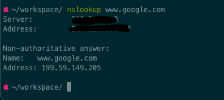

## 1 对容器所在宿主机监控
一般来说，我们在/proc等文件夹下，可以找得到需要的系统运行状况信息，包括cpu（/proc/stat），磁盘disk（/proc/self/mountinfo | /proc/self/mounts），
负载load（/proc/loadavg），内存mem（/proc/meminfo），网络net（/proc/net/dev），进程Process（/proc/pid）。
### 1.1 主机CPU基本运维命令
- `top`
    - Processes: 
        - total： 系统当前进程数
        - running：系统正在运行的进程数
        - sleeping：当前睡眠的进程数
    - Load Avg: 平均负载情况（5分钟负载，10分钟负载，15分钟负载）
    - CPU usage:
        - user: 用户空间CPU占用百分比，多核心情况下，是多核平均百分比
        - sys:内核空间CPU占用百分比，多核同理
        - idle: 空闲时间占用CPU百分比
    - MemRegions:
        - total: 全部可用内存
        - resident: 已使用内存
        - private: 空闲内存
        - shared: 缓冲内存
    - PhysMem: 
        - used: 已使用

Detail:
- PID：进程标示号
- COMMAND：进程启动的启动命令名称
- %CPU ：进程占用的CPU使用率
- TIME+：进程启动后占用的总的CPU时间
- %MEM ：进程占用的物理内存百分比

### 1.2 主机内存基本运维命令
- `free -m`
    - total：总计物理内存的大小
    - used：已使用多大
    - free：可用有多少
    - Shared：多个进程共享的内存总额
    - Buffers/cached：磁盘缓存的大小

### 1.3 主机磁盘基本运维命令
- `df -h`
查看磁盘分区使用情况，评估磁盘是否需要扩容

- `du -h –max-depth=1 *`
查看当前目录下各文件、文件夹的大小

### 1.4 主机网络基本运维命令
- `ifconfig`
用来查看和修改网卡信息，查看的网卡信息一般包括，本机网卡列表，网卡IP, 子网掩码，IPv6地址，mac地址等。

- `traceroute + [目标地址]`
traceroute用于对网络进行故障排除，检测延迟并确定到达指定目标的路径。traceroute指令让你追踪网络数据包的路由途径, 显示信息包括，主机名、数据包的大小、
所需的最大跳数、IP 地址。traceroute 命令一般发送 UDP 报文，它也可以发送 TCP 或 ICMP 数据包。

发送ICMP使用：`traceroute -I + [目标地址]`

发送TCP使用：`traceroute -T + [目标地址]`

```shell
# traceroute www.google.com
traceroute: Warning: www.google.com has multiple addresses; using 66.249.89.99
traceroute to www.l.google.com (66.249.89.99), 30 hops max, 38 byte packets
1 192.168.0.1 (192.168.0.1) 0.653 ms 0.846 ms 0.200 ms
2 118.250.4.1 (118.250.4.1) 36.610 ms 58.438 ms 55.146 ms
3 222.247.28.177 (222.247.28.177) 54.809 ms 39.879 ms 19.186 ms
4 61.187.255.253 (61.187.255.253) 18.033 ms 49.699 ms 72.147 ms
5 61.137.2.177 (61.137.2.177) 32.912 ms 72.947 ms 41.809 ms
6 202.97.46.5 (202.97.46.5) 60.436 ms 25.527 ms 40.023 ms
7 202.97.35.69 (202.97.35.69) 40.049 ms 66.091 ms 44.358 ms
8 202.97.35.110 (202.97.35.110) 42.140 ms 70.913 ms 41.144 ms
9 202.97.35.14 (202.97.35.14) 116.929 ms 57.081 ms 60.336 ms
10 202.97.60.34 (202.97.60.34) 54.871 ms 69.302 ms 64.353 ms
11 * * *
12 209.85.255.80 (209.85.255.80) 95.954 ms 79.844 ms 76.052 ms
   MPLS Label=385825 CoS=5 TTL=1 S=0
13 209.85.249.195 (209.85.249.195) 118.687 ms 120.905 ms 113.936 ms
14 72.14.236.126 (72.14.236.126) 115.843 ms 137.109 ms 186.491 ms
15 nrt04s01-in-f99.1e100.net (66.249.89.99) 168.024 ms 140.551 ms 161.127 ms
```

- `ping`
检查两个节点之间的网络连接。

- `netstat`
它提供有关不同接口的统计数据，包括打开的套接字、路由表和连接信息。

例如：`netstat | grep localhost`

- `nslookup + [目标URL]`
查看地址转换及DNS信息。



## 2 对容器进行监控
### 2.1 主机镜像元数据
- `docker images` 查看主机顶层镜像信息，`docker images -a` 查看主机包含中间层的镜像信息

### 2.2 主机容器运行情况
- `docker ps` / `docker ps -a` 查看容器信息
- `docker stats` 用来统计容器状态信息，包含容器CPU、内存、块设备IO、网络IO
- `docker inspect` / `docker inspect -f` 可以查看镜像或者容器底层详细信息，用来了解镜像或容器的完整构建信息，包括基础配置，主机配置，网络设置，状态信息。
- `docker top` 用来查看正在运行的容器中进程的运行情况，该命令可以使用户在没有通过/bin/bash终端与容器进行交互时，帮助查看容器内进程信息（进程号、父进程号、命令等）。
- `docker port` 查看容器与宿主机之间端口映射关系。

## 3 常见监控方案
- 自建agent: [gopsutil](https://github.com/shirou/gopsutil)
- google/cadvisor
- datadog等
