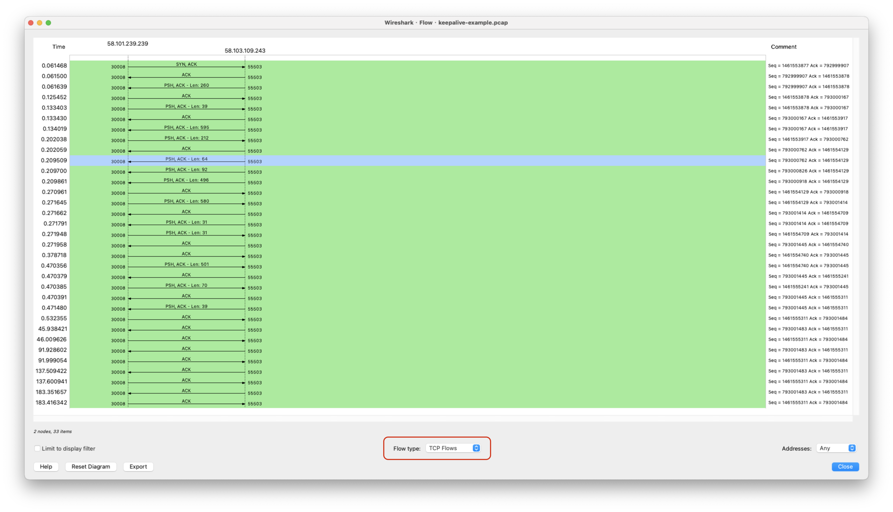
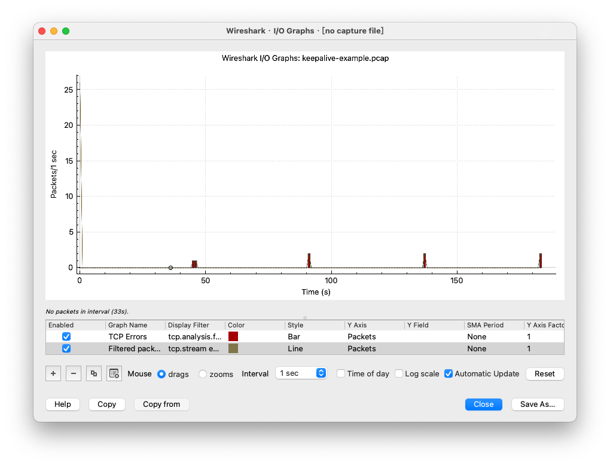

## 获取网络包
### tcpdump
下面的命令将在en0网卡上捕获所有TCP协议的数据包，并将它们写入名为tcpdump.pcap的文件中：
```shell
sudo tcpdump tcp -i en0 -w tcpdump.pcap
```

在执行此命令后，tcpdump将开始在en0网卡上监视TCP连接，并将所有捕获的数据包写入tcpdump.pcap文件。通过查看生成的pcap文件，我们可以进一步分析和调试网络问题。

下面的命令抓取目标host的流量数据包，并将它们写入名为tcpdump.pcap的文件中：
```shell
sudo tcpdump host 192.168.0.10 -w tcpdump.pcap
```

下面的命令获取端口上的流量数据包，并将它们写入名为tcpdump.pcap的文件中：
```shell
sudo tcpdump port 22 -w tcpdump.pcap
```

下面的命令获取端口上的流量数据包，并且直观的显示：
```shell
sudo tcpdump port 80 -X
```

下面的命令获取数据包文件的数据包，并且直观的显示：
```shell
sudo tcpdump -r a.pcap
```

下面的命令获取数据包文件的数据包，增加过滤，写入新的数据包文件，类似于linux的管道操作：
```shell
sudo tcpdump -r a.pcap 'tcp[tcpflags] & (tcp-rst) != 0' -w b.pcap
```

常用命令和选项：
- 子命令
    - tcp：指定抓取TCP协议的数据包；
    - udp：指定抓取UDP协议的数据包；
    - icmp：指定抓取ICMP协议的数据包；
    - host：指定抓取来自或前往指定主机的所有数据包；
    - port：指定抓取来自或前往指定端口的所有数据包；
    - net：指定抓取来自或前往指定网络的所有数据包；
- 选项
    - -i：指定抓包自那个网络接口（如: en0）；
    - -X：在输出捕获数据包时，以16进制和acsII字符混合形式显示数据部分；
    - -w：将捕获的数据包写入一个文件中；
    - -s：指定要抓取的数据包的大小，默认为65535 bytes;
    - -c：指定抓取的数据包的个数，超过个数后会停止捕获；
    - -n：不要将那些数字地址转换成域名；
    - -q：不显示tcpdump的verbose信息；
    - -v：详细显示抓包的详细信息；
    - -A：以纯文本的方式显示数据包。

如果抓取数据包中对自己有用的信息，可以研究数据包的各层分布，然后用s option控制抓取数据包的长度, 不指定s，tcpdump默认会抓每个报文的1500字节！一般来说，帧头是 14 字节，IP 头是 20 字节，TCP 头是 20~40 字节。如果你明确地知道这次抓包的重点是传输层，那么理论上，对于每一个报文，你只要抓取到传输层头部即可，也就是前 14+20+40 字节（即前 74 字节）：
```shell
sudo tcpdump -s 74 -w a.pcap
```

在抓取数据包的过程中，建议使用`Ctrl+C`或者`timeout`或者`kill`等，等待自动结束。不建议使用`kill -9`之类的强杀命令，会导致报文有些留在内存没来得及写入文件，报文异常终端，文件打开可能有问题。

## 分析网络包
### Wireshark
Wireshark 既可以分析抓包文件，也可以直接用来抓包，起到跟 tcpdump 类似的作用。比 tcpdump 更方便的是，如果直接用 Wireshark 发起抓包，窗口里就直接显示抓取到的报文了，这省去了 tcpdump 抓包后，再用 Wireshark 打开的小小的麻烦。

Wireshark分为上中下三栏：
- 上栏是所有原始报文；
- 中栏是选中某个原始报文后，OSI各层报文的情况；
- 下层是报文的字节分布情况。

选中某个报文右击选中Follw->TCP Stream可以直观的看到报文的请求响应情况。即基于一个报文，找到它所在的整个 TCP 流的所有其他报文

如何判断报文是在客户端还是在服务端抓取的，分析报文，如果报文的TTL(Time to live)是64、128、256, 那么该报文是在客户端做的，否则是在服务端做的。

如何查看网络数据流，例如查看TCP数据流：
1. 选择wireshark的Statistics
2. 选择打开Flow Graph
3. 勾选TCP Flows即可看到TCP数据包的流向

4. 如果想看IO流，可以勾选IO Graph, 其 X 轴是时间，Y 轴是性能指标. 可以通过选择+号，增加一个新的趋势折线图。统计的是二层帧的速度。

5. 如果向看TCP序列号的速度，可以Statistics内勾选TCP Stream Graphs, 统计的是四层TCP段的速度。四层比二层每个报文少了二层到四层的头部大小个字节。严格来说，TCP Stream Graphs 的斜率，只是 TCP payload 的速率；而 I/O Graph 展示的，才是我们一般谈论的传输速度。当然，在定性的讨论中，这点差异是可以忽略的。

> 实际上在TCP传输报文的过程中，发送端的每个报文都会等待接收端的ACK。当发送端收到接受端的ACK后，才算该报文被发送成功, 这个部分数据才会从发送缓存中删除。那么每个报文的传输时间就是这个过程中一来一回的时间。这个一来一回的时间被称作**时延Round Trip Time（RTT）**。

带宽，类似道路的车道数，你应该见过节假日里高速公路上停满私家车的图片。可见，车道越多，高速路越长，能容纳的车就越多。在网络世界里，带宽很大、RTT 很长的网络，被冠以一个特定的名词，叫做**长肥网络**，英文是 **Long Fat Network**。在长肥网络中的 TCP 连接，叫做**长肥管道**，英文是 **Long Fat Pipeline**。

道路上最多可以容纳多少辆车呢？显然，是车道数×道路长度。那么类似地，带宽跟往返时间（RTT）相乘，就是在空中飞行的报文的最大数量，即**带宽时延积**。在英文里叫 **Bandwidth Delay Product**，缩写是 **BDP（Delay 就是 RTT）**。所谓的长肥管道，就是带宽时延积更大的网络。

关于TTL: 值为8位，取值范围0-255, 每一个三层设备都会把路过的 IP 包的 TTL 值减去 1, 持续被路由转发并 TTL 减 1，如果 TTL 减到 0 会被丢弃。
因为 TTL 是从出发后就开始递减的，网络上我们能抓到的包，它的当前 TTL 一定比出发时的值要小。TTL 从初始值到当前值的差值，就是经过的三层设备的数量。不同的操作系统其初始 TTL 值不同，一般来说 Windows 是 128，Linux 是 64。由此，我们就可以做一些快速的判断了。

比如测试 ping www.baidu.com，收到的 TTL 是 52，那么这个百度服务端大概率是 Linux 类系统，因为用 Linux 类系统的 TTL 64 减去 52，得到 12。这意味着这个响应包在公网上经过了 12 跳的路由设备（三层设备），这个数量是符合常识的。

假如百度服务端是 Windows，而 Windows 类系统一般 TTL 为 128，那么 128 减去 52 就得到 76。那就意味着这个回包居然要途经 76 个三层设备，这显然就违背常识了，所以反证这个百度服务端不会是 Windows。

同样两个通信方之间的数据交互，其数据包在公网上容易出现路径不同的情况。就好比你每天开车上班，一般也有不止一条线路，无论走哪一条，只要能到公司就可以了。那么你和百度之间的路径，上午是 12 跳，下午变成 13 跳，或者 11 跳，也都属于正常。

### 设置抓包条件
无论是我们用Wireshark打开抓取的网络包，还是直接通过Wireshark监听机器端口上的网络等。我们都可以通过设置过滤器来过滤出我们关注的报文，在Wireshark中，设置过滤条件是在顶部的窗口中，例如我们可以设置如下条件,表明我们需要过滤出ip等于10.255.252.31，且TCP Flags为rest的报文：

```text
ip.addr eq 10.255.252.31 and tcp.flags.reset eq 1
```

- 过滤特定时间的报文
```text
frame.time >="dec 01, 2015 15:49:48" and frame.time <="dec 01, 2015 15:49:49"
```

服务端和客户端同时抓包，根据TCP报文的裸序列号，可以定位到服务端和客户端同一个报文的情况。

常用过滤数据包的条件：
```shell
# 数据链路层包含abc
frame contains abc
# 网络层包含abc
ip contains abc
# 传输层包含abc
tcp contains abc
# http应用层包含abc
http contains abc
# tcp payload包含abc
tcp.payload contains 61-62-63
# 例如，"tcp.len eq 100" 可以过滤出长度为100字节的TCP数据包。
tcp.len eq 长度
# 过滤含fin标识的报文
tcp.flags.fin eq 1
# 过滤含reset标识的报文
tcp.flags.reset eq 1
# 过滤tcp payload 等于特定值的报文
tcp.payload eq 数据
# 查看HTTP事务的报文
http
```