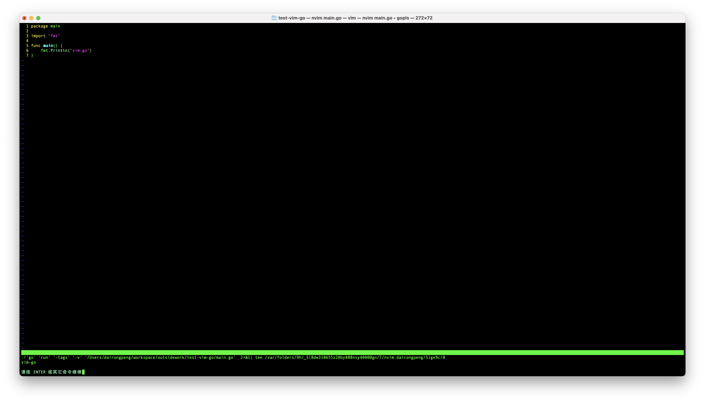
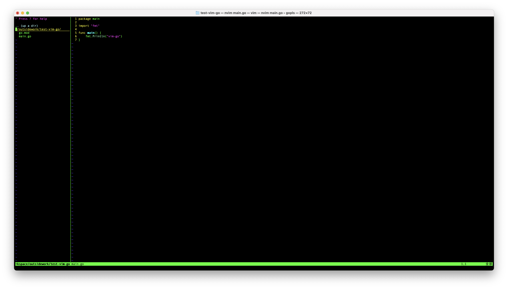

想着使用vim搭建本地环境其实有一段时间了，此前Go版本升级到1.18+，Goland低版本就不怎么兼容了。制作vim ide之前也断断续续折腾过，这次就简单整理下，以便后续快速的准备开发环境。根据最近查的资料来看，很多同学把这个ide做的太复杂了，要不是无脑堆砌插件，要么流程繁琐。本着“少就是多”的原则，结合我最近的使用及搭建情况，尽量把这个事情简单的分享出来。

我本地的环境目前是：
- 操作系统：MacOS M1
- 终端环境：Mac系统终端 + Zsh
- 版本控制：Git
- 语言环境: Go 1.20.2
- vim版本: Neovim

这里我选择Mac自带的终端，因为我感觉自带终端加上Zsh体验已经很棒了，这个也可以根据自己的情况选择是否使用iterm2，我是本着减负的原则，能满足体验，又少装一个应用最好不过。Vim的话我选择NeoVim， NeoVim放弃了对vi的兼容，但其实在新版的Vim中，也可以通过配置放弃对vi的兼容，同一份配置基本vim和neovim都可以使用。

> 提示：如果希望使用vim8配置golang编译环境可以查看`230915-Vim下Golang编辑环境升级`这篇文章介绍。

## NeoVim
下载安装NeoVim，直接使用Mac包管理工具安装即可`brew install nvim`。其他环境的使用自己的包管理工具下载安装即可。

```shell
➜  ~ nvim --version
NVIM v0.8.3
Build type: Release
LuaJIT 2.1.0-beta3
编译者 brew@HMBRW-A-001-M1-004.local

Features: +acl +iconv +tui
See ":help feature-compile"

     系统 vimrc 文件: "$VIM/sysinit.vim"
         $VIM 预设值: "/opt/homebrew/Cellar/neovim/0.8.3/share/nvim"

Run :checkhealth for more info
➜  ~ 
```

为了使得我们的默认打开的vim是nvim，可以设置终端环境变量，这样当我们在终端键入vim或者vi默认打开nvim
```bash
alias vi='nvim'
alias vim='nvim'
```

当第一次打开nvim会使用默认配置，后面调整成自己的配置文件，nvim读取的配置文件路径为`~/.config/nvim/init.vim`，我们需要创建它`mkdir ~/.config/nvim && cd ~/.config/nvim && touch init.vim`。

我们可以往init.vim文件写入如下配置，查看配置是否对nvim生效, 更多配置项可以通过查阅文档获得：

```shell
" common configure
set mouse=a " 激活鼠标使用
set wrap " 自动换行
set sw=4 " 设置软宽度
set gdefault " 行内替换
set showmatch " 高亮显示括号匹配    
set expandtab " 使用空格来替换 Tab
set tabstop=4 " 设置 Tab 长度为 4 空格    
set shiftwidth=4 " 设置自动缩进长度为 4 空格    
set autoindent " 继承前一行的缩进方式，适用于多行注释" 
set autowrite " 自动保存
set nocompatible " 关闭 vi 兼容模式
set history=1000 " 设置历史记录步数
set confirm " 在处理未保存或只读文件时，弹出确认

" 搜索逐字符高亮
set hlsearch
set incsearch

" 从不备份
set nobackup
set noswapfile
```

## 插件管理
插件管理推荐使用Git子模块管理，Git我们很多研发工作中多多少少都使用过，采用子模块插件管理可以达到同样的目的，且成本较低，也减少了重新熟悉一套新的插件管理方法。

nvim读取插件的目录在`~/.config/nvim/pack/*/start`下，`*`可以取你想要的任何名字，这里新建`~/.config/nvim/pack/vendor/start`目录。

插件如何选择，也是很多人会出现问题的地方。就像我们使用idea，vscode一样，插件很多。盲目抄作业肯定不行，选择一个插件的前提是要熟悉它，不然一个插件那么多配置项，轻则记不住那么多命令，重则爆发快捷键冲突问题。

```shell
cd ~/.config/nvim 
# 在nvim下初始化git仓库
git init
git branch -M master
```

### Git子模块操作插件(以vim-go插件举例)
- 添加一个插件
```shell
➜  nvim git:(master) ✗ git submodule add https://github.com/fatih/vim-go.git pack/vendor/start/vim-go
```

- 更新插件
```shell
➜  nvim git:(master) ✗ git submodule update --remote pack/vendor/start/vim-go
```

- 删除插件
```shell
➜  nvim git:(master) ✗ git rm -rf pack/vendor/start/vim-go
```

### vim-go
希望在vim中写golang程序，我选择安装vim-go插件。按照上述，安装vim-go插件。
```shell
➜  nvim git:(master) ✗ git submodule add https://github.com/fatih/vim-go.git pack/vendor/start/vim-go
```

vim-go 插件是一个非常流行和功能强大的 Vim 插件，它可以帮助 Golang 开发人员提高编程效率，以下是 vim-go 插件的主要功能：
1. 代码导航和跳转：vim-go 支持跳转到函数、变量、结构体定义等等，可以帮助开发者快速查看代码结构。通过 :GoDef 命令可以跳转到定义处，:GoDoc 命令可以查看文档。
2. 代码补全：vim-go 插件提供了代码补全功能，可以智能地为你推荐代码片段。使用 <C-x><C-o> 或 <C-x><C-n> 命令来启动代码补全。
3. 自动格式化：vim-go 插件可以自动格式化 Golang 代码。使用 :GoFmt 命令可以格式化当前文件，使用 :GoImports 命令可以自动导入未导入的包，同时进行格式化。
4. 调试支持：vim-go 支持使用 Delve 进行 Golang 代码调试。通过 :GoDebugStart 命令可以启动调试，:GoDebugContinue 命令可以继续执行调试。
5. 单元测试：vim-go 插件可以执行单元测试并输出测试结果。使用 :GoTest 命令可以运行测试，并将测试结果输出到 Vim 的 quickfix 窗口。
6. 语法检查：vim-go 插件可以检查语法错误，并在代码编辑时显示错误信息。使用 :GoBuild 命令可以进行语法检查，使用 :GoErrCheck 命令可以检查错误。
7. 基于 Go 的项目管理：vim-go 插件可以帮助你构建、运行和管理基于 Go 的项目。通过 :GoBuild 命令可以编译当前文件，通过 :GoRun 命令可以运行当前文件。


> 安装完vim-go后，在终端`nvim a.go`, 进入命令模式，执行`GoInstallBinaries`, vim-go会自动安装自身需要用到的go二进制。

vim-go有很多配置项，这里贴出来我整理的一些，把它粘贴在init.vim文件中保存即可。
```shell
" 禁用 Vim-indentline 插件，它会在文本编辑器中为每一行添加缩进线。
let g:indentLine_enabled=0

" golang configure ====> start
" 启用高亮显示 Golang 中的方法（method）
let g:go_highlight_methods = 1
" 启用高亮显示 Golang 中的运算符。
let g:go_highlight_operators = 1
" 启用高亮显示 Golang 中的构建约束（build constraints）。
let g:go_highlight_build_constraints = 1
" 每次保存文件时自动使用 go fmt 命令格式化代码。
let g:go_fmt_autosave = 1
" 当使用过时的 Golang 版本时，给出警告提示。
let g:go_version_warning = 1
" 自动检测当前的 GOPATH 路径。
let g:go_autodetect_gopath = 1
" 启用高亮显示 Golang 中的类型（type）。
let g:go_highlight_types = 1
" 启用高亮显示 Golang 中的字段（field）。
let g:go_highlight_fields = 1
" 启用高亮显示 Golang 中的函数（function）。
let g:go_highlight_functions = 1
" 启用高亮显示 Golang 中的函数调用（function call）。
let g:go_highlight_function_calls = 1
" 启用高亮显示 Golang 中的额外类型（extra type）。
let g:go_highlight_extra_types = 1
" 启用自动生成 tags 文件。
let g:go_highlight_generate_tags = 1
" 使用 Golang 的 LSP 实现 gopls 作为导航定义的工具。
let g:go_def_mode = 'gopls'
" 启用 Golang 的 LSP 实现 gopls。
let g:go_gopls_enabled = 1
" 启用 Golang 的代码分析工具 guru。
let g:go_guru_enabled = 1
" 启用 Golang 的实验性格式化代码命令。
let g:go_fmt_experimental = 1
" 启用 Golang 的导航定义映射（mapping）
let g:go_def_mapping_enabled = 1
" 指定在构建 Golang 项目时使用的 tags。
let g:go_build_tags = '-v'
" 指定使用的格式化命令为 goimports。
let g:go_fmt_command = "goimports"
" 指定在执行 :GoList 命令时使用的列表类型
let g:go_list_type = "quickfix"

" 设置 Leader 键为英文逗号
let mapleader = ","

" 编译、运行当前文件
nnoremap <leader>r :GoRun<CR>

```

> 这里我们可以看到，一个插件的配置项包括可用的快捷键已经非常多了，需要注意快捷键冲突问题，例如可以配置Leader为','。

测试下插件是否正常工作：
- 注意vim-go只能运行gomod管理的go程序

```shell
➜  outsidework mkdir test-vim-go
➜  outsidework cd test-vim-go 
➜  test-vim-go go mod init github.com/dairongpeng/test-vim-go
go: creating new go.mod: module github.com/dairongpeng/test-vim-go
➜  test-vim-go ls
go.mod
➜  test-vim-go vim main.go
```

在normal模式下键入`,r`,即可运行该程序。




### NERDTree
NerdTree 是 Vim 中非常流行的文件树插件，它可以帮助开发者在编辑器中方便地浏览和管理文件，以下是 NerdTree 插件的主要功能：
1. 显示文件树：NerdTree 插件可以在 Vim 窗口中显示当前项目的文件树结构，使开发者可以快速地浏览项目文件。
2. 打开文件和目录：使用 NerdTree 插件，可以通过鼠标或快捷键打开文件或目录，避免了使用 Vim 的命令行模式输入文件路径的繁琐操作。
3. 文件操作：NerdTree 插件支持在 Vim 窗口中进行文件操作，如复制、移动、重命名和删除文件等。
4. 快捷键：NerdTree 插件提供了一系列快捷键，可以方便地打开、关闭、移动和操作文件。这些快捷键可以帮助开发者更高效地使用 NerdTree 插件。
5. 过滤器：NerdTree 插件支持根据文件名或路径过滤文件，可以帮助开发者快速找到想要的文件。
6. 定制化：NerdTree 插件支持用户自定义配置，可以根据个人喜好调整字体、颜色、布局等参数。

- 安装该插件
```shell
➜  nvim git:(master) ✗ git submodule add https://github.com/preservim/nerdtree.git pack/vendor/start/nerdtree
```

直接粘贴该配置到init.vim中。

```shell
" 打开/关闭 NERDTree 窗口
nnoremap <leader>n :NERDTreeToggle<CR>
" 打开 NERDTree 窗口，并将光标移动到当前文件所在的节点
nnoremap <leader>nf :NERDTreeFind<CR>
" 在 NERDTree 窗口中打开文件
nnoremap <leader>no :NERDTreeFind<CR>
" 在 NERDTree 窗口中刷新当前目录
nnoremap <leader>nr :NERDTreeRefreshRoot<CR>
" 在 NERDTree 窗口中上下移动光标
nnoremap <C-j> :NERDTreeFocus<CR><C-w>j
nnoremap <C-k> :NERDTreeFocus<CR><C-w>k
" 在 NERDTree 窗口中打开文件时自动关闭 NERDTree 窗口
let g:NERDTreeAutoClose = 1
```

打开刚才我们测试的main.go文件，键入`,n` 即可以打开目录。



以上两个插件，在编写golang代码时已经足够了，在我们完全熟悉了这两个插件后，再考虑扩展插件。我的建议是，插件能少装不多装，在明确了某个插件能给你带来效率提升又不会给你造成负担的时候，再考虑安装，力求做到使用的插件都是自己了然于心的，而不是抄作业安装一大堆不大懂的插件，后续解决问题起来非常困难。

## 附：
- [Nvim本文完整插件配置](https://github.com/dairongpeng/nvim)