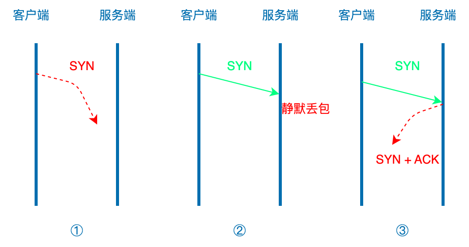
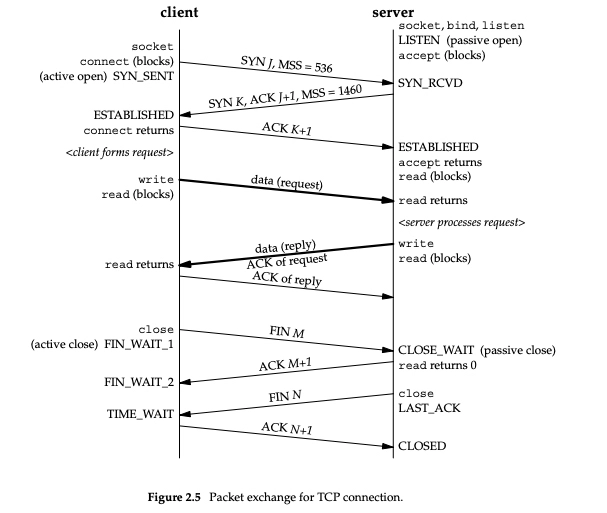
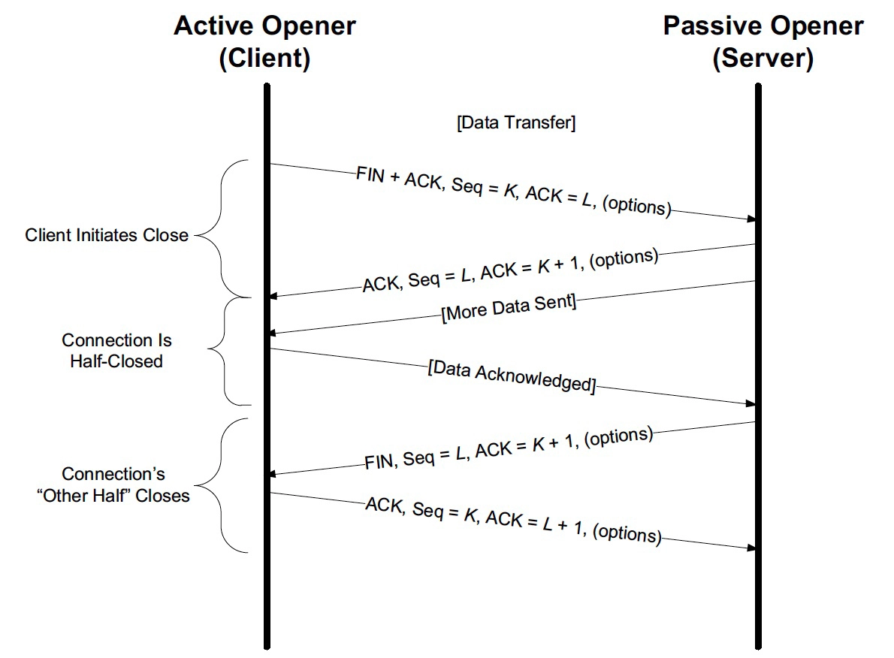

## 握手（建立连接）
TCP握手一般会经过三个阶段：
- 客户端发建立连接的信号SYN（SYN）
- 服务端发该链接的ACK，顺带发与客户端建立链接的信号SYN（SYN + ACK）
- 客户端发给服务端ACK（ACK）

模拟客户端发送SYN，未收到服务端ACK的场景。


1. 修改服务端的iptables防火墙规则

这个iptables语句的意思是将TCP协议的8080端口的入站流量全部禁用。简单来说，通过iptables防火墙对流量进行过滤，将所有TCP协议的8080端口的入站流量都丢弃（drop）。通常是为了防止Web服务器面临网络攻击、DDoS攻击等安全漏洞而采取的一种保护措施。

- iptables：是一种Linux系统下的iptables命令工具，可以用于配置和管理Linux系统内置的网络防火墙功能。
- -I INPUT：指定插入一条规则到防火墙的“INPUT”链中，这条规则将会被放在链的最前面。
- -p tcp：指定规则只针对TCP协议的流量进行操作。
- --dport 8080：指定规则只针对目的端口为8080的流量进行操作。
- -j DROP：指定对满足条件的流量采用丢弃（Drop）的操作，即该规则匹配的数据包将不会被进一步处理，直接被防火墙丢弃。


这个规则将会禁用所有TCP协议的80端口的入站流量，包括来自于Web客户端的HTTP请求，以及Web服务器返回给客户端的响应数据。如果要允许特定的IP地址或者IP地址段的流量通过，可以使用其他iptables规则来实现。
```shell
# 新项目可使用nftables代替，可查阅nftables文档; 云服务器，直接在控制台关闭该端口即可
# iptables -I INPUT -p tcp --dport 8080 -j DROP
```

2. 在客户端启动tcpdump抓包

使用TCPDUMP工具在Linux系统下通过网卡抓取流量，将监听到的所有端口为8080的流量保存下来，并写入到名称为"telnet-8080.pcap"的文件中。

- -i any: 监听所有网卡设备的数据包，包括本地环回接口（loopback interface）和所有物理网卡。
- -w telnet-8080.pcap: 将抓取到的网络数据包写入到一个文件中，并将其保存在名为"telnet-8080.pcap"的文件中。
- port 8080: 过滤我们所监听的TCP/UDP端口号为8080的数据包，只抓取监听端口号为8080的数据包。默认源端口和目的端口为8080的都抓，但是也可以指定抓源端口`src port 8080`，抓目的端口`dst port 8080`

```shell
sudo tcpdump -i any -w telnet-8080.pcap src port 8080
```

在数据包中Flags标识位：
- [S]标识SYN
- [S.]标识SYN+ACK
- [.]标识ACK
- [P]标识表示推送数据PUSH，告诉对方立即将数据推送给应用层，即避免数据缓存。
- [F]标识FIN，表示结束若干数据段、关闭当前连接。通常在 TCP 四次握手的第一次阶段发送 FIN 数据包。
- [U]标识Urgent，表示本次传输中有紧急数据需要传输，数据包处理时应优先处理该数据。在发送一个紧急数据时，可以将 URG 标志置为 1，同时将紧急指针字段的值设置为对应紧急数据的偏移量。
- [R]标识Reset，标志通常表示重置连接，常用于拒绝非法数据或异常连接。当网络发生故障或者 TCP 连接遭遇恶意攻击时，可以使用 RST 标志进行重置，清除错误状态，恢复正常连接。防火墙可以通过RST报文，控制客户端无法建立连接。
    - 客户端 —> 防火墙（ip_forward=1; net地址转换） -> 服务端、
    - 服务端 -> 防火墙（ip_forward=1; net地址转换） -> RST（当判断是需要拦截的报文，会拦截原始报文，发送RSE） -> 客户端
    - 客户端判断该RST是防火墙返回的而不是服务端返回的，可以通过丢弃RST报文、也可以客户端加混淆，让防火墙不具备密钥，模拟不了RST包。

网络包标志位通常作为 TCP/IP 协议中常见保障机制并不一定是还有更多的标志位，如 SYN-ACK 和 FIN-ACK 。在分析网络数据包时，了解这些标志位所代表的含义可以帮助快速识别问题，确定网络故障，并进行迅速的修复。

3. 从客户端发送一次telnet到服务端

```shell
telnet 13.215.227.51 8080
```

当我们防火墙规则打开服务端8080时:
```shell
# 终端1
➜  ~ sudo tcpdump -i any host 13.215.227.51 and port 8080
tcpdump: data link type PKTAP
tcpdump: verbose output suppressed, use -v or -vv for full protocol decode
listening on any, link-type PKTAP (Apple DLT_PKTAP), capture size 262144 bytes
13:19:41.718180 IP 198.18.0.1.52584 > ec2-13-215-227-51.ap-southeast-1.compute.amazonaws.com.http-alt: Flags [SEW], seq 3545030176, win 65535, options [mss 3960,nop,wscale 6,nop,nop,TS val 3792437748 ecr 0,sackOK,eol], length 0
13:19:41.718461 IP ec2-13-215-227-51.ap-southeast-1.compute.amazonaws.com.http-alt > 198.18.0.1.52584: Flags [S.], seq 11884486, ack 3545030177, win 16384, options [mss 1460], length 0
13:19:41.718525 IP 198.18.0.1.52584 > ec2-13-215-227-51.ap-southeast-1.compute.amazonaws.com.http-alt: Flags [.], ack 1, win 65535, length 0
13:19:41.772690 IP 192.168.6.163.52585 > ec2-13-215-227-51.ap-southeast-1.compute.amazonaws.com.http-alt: Flags [S], seq 1593448136, win 65535, options [mss 1460,nop,wscale 6,nop,nop,TS val 3374254449 ecr 0,sackOK,eol], length 0
13:19:41.851472 IP ec2-13-215-227-51.ap-southeast-1.compute.amazonaws.com.http-alt > 192.168.6.163.52585: Flags [S.], seq 2372461373, ack 1593448137, win 62643, options [mss 1460,sackOK,TS val 1392998951 ecr 3374254449,nop,wscale 7], length 0
13:19:41.851563 IP 192.168.6.163.52585 > ec2-13-215-227-51.ap-southeast-1.compute.amazonaws.com.http-alt: Flags [.], ack 1, win 2058, options [nop,nop,TS val 3374254529 ecr 1392998951], length 0
13:19:57.013255 IP ec2-13-215-227-51.ap-southeast-1.compute.amazonaws.com.http-alt > 192.168.6.163.52585: Flags [.], ack 1, win 490, options [nop,nop,TS val 1393014049 ecr 3374254529], length 0
```

```shell
# 终端2
➜  ~ telnet 13.215.227.51 8080
Trying 13.215.227.51...
Connected to ec2-13-215-227-51.ap-southeast-1.compute.amazonaws.com.
Escape character is '^]'.
^Z
Connection closed by foreign host.
```

当我们防火墙关闭服务端8080时：

```shell
# 终端1
➜  ~ sudo tcpdump -i any host 13.215.227.51 and src port 8080 
Password:
tcpdump: data link type PKTAP
tcpdump: verbose output suppressed, use -v or -vv for full protocol decode
listening on any, link-type PKTAP (Apple DLT_PKTAP), capture size 262144 bytes
13:13:16.271623 IP ec2-13-215-227-51.ap-southeast-1.compute.amazonaws.com.http-alt > 198.18.0.1.52328: Flags [S.], seq 10608032, ack 77427911, win 16384, options [mss 1460], length 0
13:13:21.329553 IP ec2-13-215-227-51.ap-southeast-1.compute.amazonaws.com.http-alt > 198.18.0.1.52328: Flags [F.], seq 1, ack 1, win 16384, length 0
13:13:21.329849 IP ec2-13-215-227-51.ap-southeast-1.compute.amazonaws.com.http-alt > 198.18.0.1.52328: Flags [.], ack 2, win 16383, length 0
```

```shell
# 终端2
➜  ~ telnet 13.215.227.51 8080
Trying 13.215.227.51...
Connected to ec2-13-215-227-51.ap-southeast-1.compute.amazonaws.com.
Escape character is '^]'.
Connection closed by foreign host.
```

在TCP中，如果客户端发送SYN后迟迟未收到服务端的响应包，会采用指数退避算法来重新发送SYN, 根据操作系统的net.ipv4.tcp_syn_retries参数控制重试的次数，一般为6次。如果服务端不是丢包Drop而是直接拒绝包REJECT, 那么客户端收到拒绝响应会直接退出，不会再进行尝试。拒绝报文有可能不是通过TCP而是通过ICMP协议传给客户端的

## 挥手（断开链接）
首先TCP的挥手，可以是客户端也可以是服务端主动发起。与握手不通，握手是客户端首先发起。FIN 和 ACK 都各有两次。一方发送 FIN 只是表示这一方不再发送新的数据，还可以接收数据，对方仍可以发送数据。也就是哪一方发送了FIN，就不再发送数据了。

TCP握手挥手详解：


1. 客户端发送完SYN，进入SYN_SENT状态
2. 服务端收到SYN后，进入SYN_RCVD状态，并发送SYN+ACK
3. 客户端收到服务端的SYN+ACK进入ESTABLISHED状态（因为收到自身发送出去SYN的ACK）。而此时服务端发送的SYN还未收到ACK, 仍处于SYN_RCVD状态
4. 服务端收到自身发送到SYN的ACK后，进入ESTABLISHED状态，至此客户端和服务端握手完毕，可以进行通信。

TCP挥手，也可能会存在搭顺风车的情况，整体仍然会满足四次挥手，结合上图，即：
1. 发起端发送断开链接的标识FIN，此时发起端状态为FIN_WAIT_1
2. 接收端发送ACK表示同意发起端的断开, 接收端状态变为CLOSE-WAIT, 发送端收到ACK后状态变为FIN_WAIT_2
3. 接收端发送FIN给发送端, 此时发送端状态为TIME_WAIT
4. 发送端发送ACK给接收端，也标识可以断开。CLOSED

挥手完毕，连接断开。

注意：

1. TCP数据分段相关信息，在握手的时候双方会报告自身的网络MTU, MTU是网络最大传输单元，属于网络第三层的信息。当我们执行`ip addr`可以看到每个网卡的MTU大小。一般来说MTU包含MSS(Maximum Segment Size)、TCP头部、IP头部组成。比如en0网卡的MTU为150，那么去除TCP头部20字节，IP头部20字节，实际的TCP荷载最大为1460字节。
2. 关于TSO/GRO。为了提高性能，网卡厂商们提供了一个特性，就是让这个分段的工作从内核下沉到网卡上来完成，这个特性就是 TCP Segmentation Offload(TSO)。产生的现象是我们在抓包的时候，会抓取到TCP荷载大于MSS的情况比如2800字节，这并不是说这些报文真的是以 2800 字节这个尺寸从网络上传输过来的，而是由于接收端启用了 GRO（Generic Receive Offload），由接收端的网卡负责把几个小报文“拼接”成了 2800 字节。

想要确认你的网卡是否启用了TSO特性，可以用 ethtool 命令:
```shell
$ ethtool -k enp0s3 | grep offload
# 这里是关键
tcp-segmentation-offload: on
generic-segmentation-offload: on
# 这里是关键
generic-receive-offload: on
large-receive-offload: off [fixed]
rx-vlan-offload: on
tx-vlan-offload: on [fixed]
l2-fwd-offload: off [fixed]
hw-tc-offload: off [fixed]
esp-hw-offload: off [fixed]
esp-tx-csum-hw-offload: off [fixed]
rx-udp_tunnel-port-offload: off [fixed]
tls-hw-tx-offload: off [fixed]
tls-hw-rx-offload: off [fixed]
```

### TCP分段
1. 应用层消息太大
2. 传输层查看是否超过了TCP荷载，即MSS
3. 如果超过了，就对应用层消息分段传输

### IP分片
在现实场景里，IP 分片是需要尽量避免的，原因有很多，主要是因为互联网是一个松散的架构，这就导致路径中的各个环节未必会完全遵照所有的约定。比如你发出了大于 PMTU 的报文，寄希望于 MTU 较小的那个网络环节为你做分片，但事实上它可能不做分片，而是直接丢弃，比如下面两种情况：

- 它考虑到开销等问题，未必做分片，所以直接丢弃。
- 如果你的报文有 DF 标志位，那么也是直接丢弃。

另外一个原因是，分片后，TCP 报文头部只在第一个 IP 分片中，后续分片不带 TCP 头部，那么防火墙就不知道后面这几个报文用的传输层协议是什么，可能判断为有害报文而丢弃。

总之，为了避免这些麻烦，我们还是不要开启 IP 分片功能。事实上，Linux 默认的配置就是，发出的 IP 报文都设置了 DF 位，就是明确告诉每个三层设备：“不要对我的报文做分片，如果超出了你的 MTU，那就直接丢弃，好过你慢腾腾地做分片，反而降低了网络性能”。


对于挥手，下面这张原图解释的很详细：

- 发起方发送FIN后，不再发送数据，仍可接受数据，发送数据功能关闭。（Client Initates Close）
- 发送方接受到接收端对于自己FIN的回应ACK后，表明自身的断开链接已经OK, 此时整个TCP传输处于半关闭状态，也就是发送端关闭状态（Connection Is Half-Closed）, 等待接受服务端的FIN
- 接收端处理完自己的工作后，发送FIN, 此时接收端后续也不会再发送数据，发送端收到FIN，发送ACK, 接受端收到ACK后也断开链接。这个过程是TCP传输过程的另一个半关闭状态。
- 两个半关闭状态，构成了整个TCP传输挥手过程中的最终关闭状态。