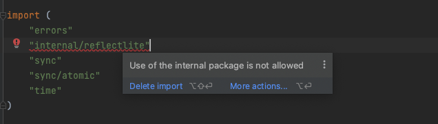

# 如何阅读Go源代码

在Golang官方文档中，已经说明为Golang源码做贡献的步骤，可以参考[这里](https://go.dev/doc/contribute)。

在我本地构建的过程中，把关键的步骤，以及遇到的一些问题记录下来，希望对看到这里的朋友有所帮助。

## 本地环境
1. 版本控制：Git
2. OS：Mac M1 Chip
3. 编译器：Goland

## 获取源代码
```shell
➜  ex git clone https://go.googlesource.com/go
Cloning into 'go'...
remote: Total 578022 (delta 421630), reused 578022 (delta 421630)
Receiving objects: 100% (578022/578022), 487.27 MiB | 5.56 MiB/s, done.
Resolving deltas: 100% (421630/421630), done.
Updating files: 100% (12469/12469), done.
```

## 本地编译
```shell
➜  ex cd go/src
➜  src git:(master) ./all.bash
Building Go cmd/dist using /usr/local/go. (go1.20.4 darwin/arm64)
Building Go toolchain1 using /usr/local/go.
Building Go bootstrap cmd/go (go_bootstrap) using Go toolchain1.
Building Go toolchain2 using go_bootstrap and Go toolchain1.
Building Go toolchain3 using go_bootstrap and Go toolchain2.
Building packages and commands for darwin/arm64.

##### Test execution environment.
# GOARCH: arm64
# CPU: 
# GOOS: darwin
# OS Version: Darwin 21.6.0 Darwin Kernel Version 21.6.0: Wed Aug 10 14:28:23 PDT 2022; root:xnu-8020.141.5~2/RELEASE_ARM64_T6000 arm64

##### Testing packages.
ok  	archive/tar	0.784s
ok  	archive/zip	0.395s
ok  	bufio	0.992s

# ...... 过程信息省略

##### Testing cgo
ok  	cmd/cgo/internal/test	0.861s
ok  	cmd/cgo/internal/test	1.212s
ok  	cmd/cgo/internal/test	1.163s
ok  	cmd/cgo/internal/test	0.936s
ok  	cmd/cgo/internal/test	0.968s

##### ../test
ok  	cmd/internal/testdir	258.525s

##### API check
ok  	cmd/api	12.045s

ALL TESTS PASSED
---
Installed Go for darwin/arm64 in /Users/dairongpeng/workspace/outsidework/ex/go
Installed commands in /Users/dairongpeng/workspace/outsidework/ex/go/bin
*** You need to add /Users/dairongpeng/workspace/outsidework/ex/go/bin to your PATH.
```

当本地运行`all.bash`获取到`ALL TESTS PASSED`标识时，说明源码包在本地编译是没有问题的，可以用来验证自己的修改或者下载的源码包的正确性。

## 使用Goland打开
这里打开后，由于本地存在Golang，所以默认GOROOT已经被指定。导致当前项目引用一些`internal`包出现错误，因为go的`internal`包不允许被外部引用。



观察`all.bash`，显示命令必须要在GOROOT下的src下构建。默认把当前源码目录当成GOROOT

```shell
#!/usr/bin/env bash
# Copyright 2009 The Go Authors. All rights reserved.
# Use of this source code is governed by a BSD-style
# license that can be found in the LICENSE file.

set -e
if [ ! -f make.bash ]; then
	echo 'all.bash must be run from $GOROOT/src' 1>&2
	exit 1
fi
. ./make.bash "$@" --no-banner
bash run.bash --no-rebuild
$GOTOOLDIR/dist banner  # print build info
```

打开设置，*设置GOROOT为当前文件夹*，默认会使用全局的GOROOT, 即可修复导包的错误。

## 修改调试
每次修改调试后，确定当前资源包没有问题的办法，仍然是`./all.bash`, 接下来就可以在Goland中高效的阅读Golang源代码了。