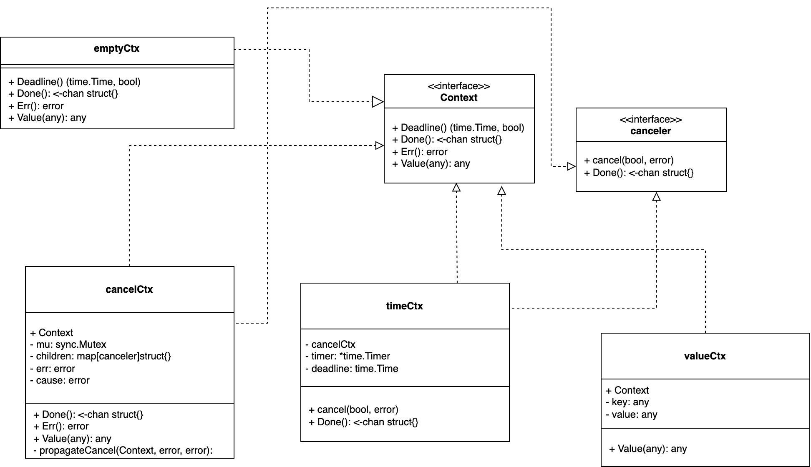

# Context简介

官方概述的第一句话是这么介绍Context包的：
```text
Package context defines the Context type, which carries deadlines, cancellation signals, and other request-scoped values across API boundaries and between processes.
```

由此，Context最重要的功能无异于`carries deadlines`, `cancellation signals`, 和`request-scoped values`;

在Golang标准库中，Context实现为接口。任何实现了`Deadline`, `Done`,`Err()`, `Value`方法的结构，默认实现了Context接口。
```golang
type Context interface {
	Deadline() (deadline time.Time, ok bool)
	Done() <-chan struct{}
	Err() error
	Value(key any) any
}
```

在context包中，实现了Context接口的结构如下:

1. `emptyCtx`结构实现了Context接口的所有方法，从而实现了Context接口。
2. `todoCtx`, `backgroundCtx`通过组合`emptyCtx`，从而实现了Context接口。
3. `cancelCtx`, `stopCtx`, `withoutCancelCtx`, `valueCtx`结构通过直接组合`Context`接口，并实现接口的方法，从而实现了Context接口。
4. `timerCtx`, `afterFuncCtx`通过组合`cancelCtx`, 从而实现了Context接口。

一些重要的Ctx解释：

- emptyCtx：空的ctx，一般用于生成根节点，例如`TODO()`, `Background()`方法产生ctx；
- cancelCtx：context包的核心结构，用来处理取消节点及其子节点的相关操作；
- timerCtx：用来处理超时取消相关操作，例如定时取消`WithTimeOut`，截止日期取消`WithDeadline`等；
- valueCtx：附加值的实现方法，常用语跨Api，跨协程传递trace信息等。

## 关于结构和接口的组合问题

### 结构组合接口

如果一个结构通过组合接口，来达到实现接口的目的，那么该结构一定要实现接口中的所有方法, 且在。和结构组合结构有些不同。关于结构组合接口，有以下特点：

- 结构体没有实现接口的方法，那么结构体对象不能调用接口的任何方法，否则 Panic nil
- 结构体只实现了接口的部分方法，那么结构体对象只能调用对应已经实现的方法，对于其他的方法调用 Panic nil
- 结构体完全实现接口的所有方法，那么结构体对象可以调用接口的所有方法，这种情况称之为面向对象中的接口方法实现。

总之就是，如果struct完全实现interface所有方法，但是struct中组合了该interface，那么并不能说明该interface字段一定不为nil。 因此只要struct组合任何interface、struct、指针类型对象，都应该对该字段进行 初始化！

### 结构组合结构

结构组合结构的情况，达到对原有结构扩展的目的。加入A结构组合了B结构，如果B是结构默认就是结构对应的零值，如果B是指针，则默认就是nil。

- B是结构：A调用B的方法，可行。如果在该方法中使用到了B的字段，那么字段为默认类型的零值。

- B是指针：如果B指针不为nil，A可以正常调用B的方法；如果B指针为nil则通过A访问B的方法会出现两种情况：

	- 当访问B的结构体字段时，报panic nil
	- 当不访问B结构体字段时，可以调用B的方法。

### 接口组合接口

可以直接理解为，扩展了原有接口的方法集合。例如A接口组合了B接口，那么认为A接口的接口方法是原A接口和B接口，两接口的所有方法。


# Context初始化

context结构可以链成一个树结构，存在父子的概念（后面会看到，父context被取消，则所有子context也会被取消），数的根节点来源可以由两处产生。

```golang
// 来源于TODO
ctx := context.TODO()
// 来源于Background
ctx := context.Background()
```

观察源码可以发现，这两个`根context`仅仅只有名称的区别, 本质都来自于emptyCtx，且仅仅组合了emptyCtx。
```golang
type backgroundCtx struct{ emptyCtx }

func (backgroundCtx) String() string {
	return "context.Background"
}

type todoCtx struct{ emptyCtx }

func (todoCtx) String() string {
	return "context.TODO"
}
```

# Context基础功能

## 取消信号（cancellation signals）

### 标准库WithCancel

在标准库中，可以直接通过WithCancel，传入一个父Ctx，构建一个子cancelCtx和一个取消函数cancel。子cancelCtx结构内嵌的Context接口，直接由父Ctx赋值。

```golang
func WithCancel(parent Context) (ctx Context, cancel CancelFunc) {
	c := withCancel(parent)
	return c, func() { c.cancel(true, Canceled, nil) }
}

// 子cancelCtx组合了parent，所以可以理解为新的ctx扩展了原有的ctx
func withCancel(parent Context) *cancelCtx {
	if parent == nil {
		panic("cannot create context from nil parent")
	}
	// 子Ctx
	c := &cancelCtx{}
	// c的Context直接由parent赋值
	// 再判断parent是不是一个可取消的Ctx，这里我们的使用场景不是，略
	c.propagateCancel(parent, c)
	return c
}
```

使用场景：

```golang
func main() {
	sig := make(chan bool)

	ctx := context.Background()
	// newCtx 扩展了ctx，是一个cancelCtx
	newCtx, cancel := context.WithCancel(ctx)

	// 此时newCtx是一个cancelCtx，当调用cancel函数时，
	// ctx.Done的通道会收到信号。按照ctx传递到不通的协程，仍可以收到信号
	go func(ctx context.Context) {
		select {
		case <-ctx.Done():
			fmt.Println("被取消正常退出...")
			sig <- true
		case <-time.After(5 * time.Second):
			fmt.Println("超时退出...")
			sig <- false
		}
	}(newCtx)

	cancel()
	<-sig
}
```

## 超时控制（carries deadline）

### 标准库WithTimeOut

在标准库中，构建携带超时控制的Ctx可以有如下方法：

```golang
// 构建携带cancel回调的Context
func WithTimeout(parent Context, timeout time.Duration) (Context, CancelFunc)

// 类似WithTimeout，且如果超时时间内，cancelCtx还未fork出来，无需提供cancel的回调，直接取消，且给出错误信息
func WithTimeoutCause(parent Context, timeout time.Duration, cause error) (Context, CancelFunc)
```

使用场景：

```golang
func main() {
	parent := context.Background()

	// 通过已有的parent ctx，构建带超时时间的childCtx，1s后，childCtx会被超时取消
	// 超时取消时，childCtx.Done()的chan会收到超时信号
	// 手动调用cancel()函数，也会触发childCtx.Done()产生Done信号。只不过大多数情况下都是使用defer cancel()
	childCtx, cancel := context.WithTimeout(parent, 1*time.Second)
	defer cancel()

	select {
	case <-time.After(5 * time.Second):
		fmt.Println("非正常超时退出")
	case <-childCtx.Done():
		fmt.Println(childCtx.Err()) // 输出 "context deadline exceeded"
	}
}
```

### 标准库WithDeadline

与`WithTimeout`用法类似，区别为，`WithTimeout`是指定多久后超时退出，而`WithDeadline`是指定到什么时间点退出。在标准库中，`WithTimeout`也是通过封装`WithDeadline`来实现的, 不再赘述。

```golang
func WithTimeout(parent Context, timeout time.Duration) (Context, CancelFunc) {
	return WithDeadline(parent, time.Now().Add(timeout))
}
```

## 传递键值（request-scoped values）

### 标准库WithValue
通常，我们代码中的Ctx会被层层传递，或者父Ctx会分裂出子Ctx层层传递。在传递的过程中，我们可以通过WithValue携带信息传递。通常被用在Api调用的链路追踪中去。

```golang
func WithValue(parent Context, key, val any) Context {
	if parent == nil {
		panic("cannot create context from nil parent")
	}
	if key == nil {
		panic("nil key")
	}
	if !reflectlite.TypeOf(key).Comparable() {
		panic("key is not comparable")
	}
	// 父Ctx（parent）会被组合到valueCtx，作为其内嵌Context接口的实现，实现扩展。
	return &valueCtx{parent, key, val}
}
```

使用场景：

```golang
func main() {
	sig := make(chan bool, 0)

	// 此时valueCtx携带key value信息
	valueCtx := context.WithValue(context.Background(), "key", "value")
	// 通过valueCtx构造cancelCtx，此时cancelCtx通过组合其父亲，也携带了key value信息
	cancelCtx, cancel := context.WithCancel(valueCtx)
	
	// 需要注意的是，cancel取消的是cancelCtx节点及其子节点
	defer cancel()

	// 把cancelCtx跨协程传递下去
	go func(ctx context.Context) {
		// 在协程中，再通过协程外传入的ctx，分裂出子newCancelCtx
		newCancelCtx, newCancel := context.WithCancel(ctx)
		
		// 需要注意的是，newCancel取消的是newCancelCtx节点及其子节点
		defer newCancel()

		// 校验，协程外的cancelCtx是否把key value信息跨协程传输了进来
		if newCancelCtx.Value("key").(string) != "value" {
			log.Println("键值对信息丢失...")
			sig <- false
			return
		}

		log.Println("键值对信息正常传递...")
		sig <- true
	}(cancelCtx)

	<-sig
}
```

通过valueCtx传递调用链路信息，在各大开源框架中也存在大量使用，例如在grpc-go中，我们获取请求原信息，是从metadata中获取，其中metadata就使用了valueCtx来存储信息。

```golang
func NewOutgoingContext(ctx context.Context, md MD) context.Context {
    return context.WithValue(ctx, mdOutgoingKey{}, rawMD{md: md})
}
```

# Context依赖关系


Ref: https://pkg.go.dev/context@go1.20.4