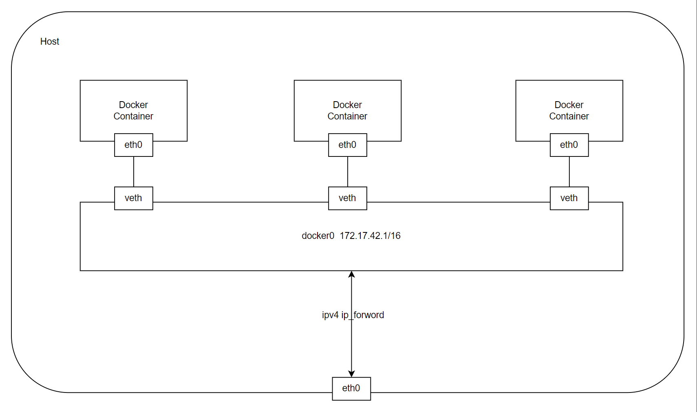
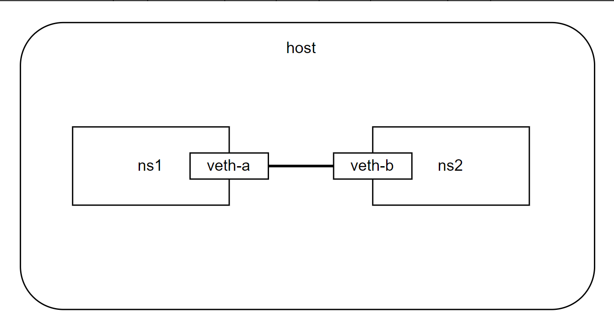

### Docker常用网络驱动
Docker默认提供了四种网络驱动：
1. Host: host网络驱动可以让容器与宿主机公用同一个网络环境，实际上是不适用Network namespace实现的，这么做缺乏安全性，且Docker提供的这种网络驱动只可以在Linux及类Linux操作系统上使用，Docker For Win 和Docker For Mac无法使用。
2. Bridge: 该种驱动是Docker默认使用的网络驱动，容器没有对外的IP，只可以通过NAT地址转换实现对外通信，通过Docker0网桥。同主机的容器间可以通过link的方式通信，但是这种方式不能解决跨主机容器直接通信的问题，难以满足复杂的场景。
3. Overlay：该驱动可以用于跨主机网络通信，但必须要配合Swarm进行配置和使用才可。
4. Null: 该驱动实际上不进行任何网络设置。

Docker默认网络驱动拓扑：


### Linux网络隔离技术
如何隔离一个网络环境：
```shell
# 添加一个network namespace
dairongpeng@DESKTOP-11H701Q:~$ sudo ip netns add nstest
# 查看该ns的网卡信息，
dairongpeng@DESKTOP-11H701Q:~$ sudo ip netns exec nstest ip addr
1: lo: <LOOPBACK> mtu 65536 qdisc noop state DOWN group default qlen 1000
    link/loopback 00:00:00:00:00:00 brd 00:00:00:00:00:00
2: tunl0@NONE: <NOARP> mtu 1480 qdisc noop state DOWN group default qlen 1000
    link/ipip 0.0.0.0 brd 0.0.0.0
3: sit0@NONE: <NOARP> mtu 1480 qdisc noop state DOWN group default qlen 1000
    link/sit 0.0.0.0 brd 0.0.0.0
dairongpeng@DESKTOP-11H701Q:~$ sudo ip netns list
nstest
dairongpeng@DESKTOP-11H701Q:~$ sudo ip netns delete nstest
dairongpeng@DESKTOP-11H701Q:~$ sudo ip netns list
dairongpeng@DESKTOP-11H701Q:~$
```

> 或者可以通过`sudo ip netns exec nstest bash`进入该namespace，再正常执行shell即可。退出直接`exit`


### Linux网络模拟网络拓扑
使用虚拟网卡，配置并验证两个network namespace的连通性：
```shell
# 创建两个ns
dairongpeng@DESKTOP-11H701Q:~$ sudo ip netns add ns1
dairongpeng@DESKTOP-11H701Q:~$ sudo ip netns add ns2
# veth pair是成对出现的一种虚拟网络设备接口，创建veth pair设备veth-a和veth-b
dairongpeng@DESKTOP-11H701Q:~$ sudo ip link add veth-a type veth peer name veth-b
# 讲两张虚拟网卡分别放到两个network namespace中
dairongpeng@DESKTOP-11H701Q:~$ sudo ip link set veth-a netns ns1
dairongpeng@DESKTOP-11H701Q:~$ sudo ip link set veth-b netns ns2
# 启动两张虚拟网卡
dairongpeng@DESKTOP-11H701Q:~$ sudo ip netns exec ns1 ip link set dev veth-a up
dairongpeng@DESKTOP-11H701Q:~$ sudo ip netns exec ns2 ip link set dev veth-b up
# 分配两张网卡的IP
dairongpeng@DESKTOP-11H701Q:~$ sudo ip netns exec ns1 ip addr add 10.0.0.1/24 dev veth-a
dairongpeng@DESKTOP-11H701Q:~$ sudo ip netns exec ns2 ip addr add 10.0.0.2/24 dev veth-b
# 测试两张网卡的连通性
dairongpeng@DESKTOP-11H701Q:~$ sudo ip netns exec ns1 ping 10.0.0.2
PING 10.0.0.2 (10.0.0.2) 56(84) bytes of data.
64 bytes from 10.0.0.2: icmp_seq=1 ttl=64 time=0.041 ms
64 bytes from 10.0.0.2: icmp_seq=2 ttl=64 time=0.029 ms
64 bytes from 10.0.0.2: icmp_seq=3 ttl=64 time=0.030 ms
64 bytes from 10.0.0.2: icmp_seq=4 ttl=64 time=0.034 ms
^Z
[1]+  Stopped                 sudo ip netns exec ns1 ping 10.0.0.2
```
构建网络拓扑如下：


