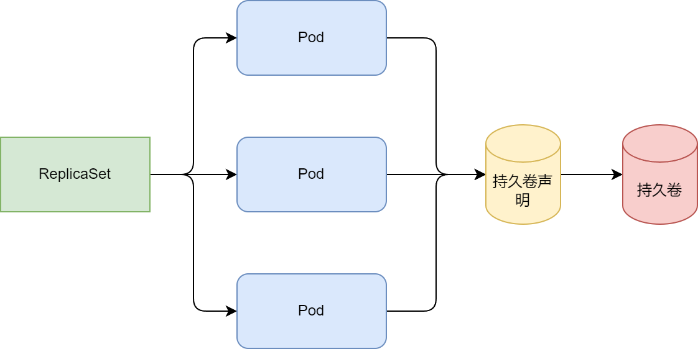
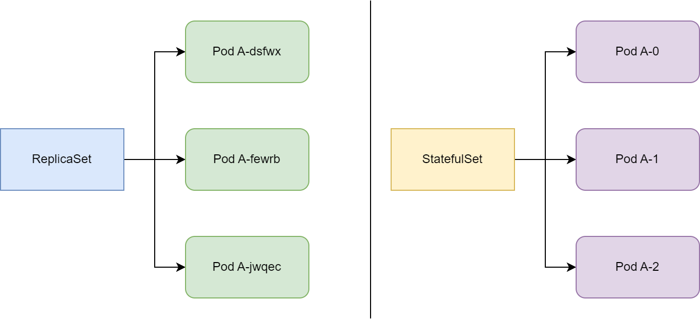
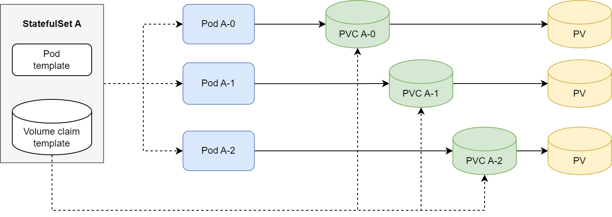

## StatefulSet
在之前的例子中，我们可以通过pod控制器加一个持久卷，实现有状态的pod控制器，以ReplicaSet为例。所有pod共享该持久卷。本质上三个pod无区别，可以任意扩容或缩容。



如何让每个pod实例都有单独存储的多副本，即每个pod都提供稳定的标识呢？一种取巧的方法是每个成员实例都创建单独的k8s service，来提供稳定的网络地址，可以在集群应用的配置中，配置各自实例被代理的service的IP地址即可。但该方法配置繁琐。

在kubernetes中存在专门真多该场景的资源，就是StatefulSet资源。通过StatefulSet控制的pod，如果某个实例pod销毁再重建，新建的这个实例，需要跟之前被销毁的实例，拥有完全一致的状态和标识。

### StatefulSet简介
RS和RC包括Deployment(本质也是用RS管理)控制的pod，是无状态的，可以可以很简单的替换为全新的pod。而有状态的pod的替换（挂掉重建或者节点故障重建），新建的pod实例与被替换的实例拥有相同的名称，网络，标识，状态，这就是StatefulSet管理pod的手段。


注意：StatefulSet也是通过容器模板来控制副本数的，但是其创建的pod副本并不完全是一样的。每个pod都可以拥有一组独立的数据卷（持久化状态）、但是pod名称索引，呈现出一定的规律，例如kafka-0、kafka-1、kafka-2等。



StatefulSet缩容不会很迅速，因为是线性的，对于有状态应用来说，两个实例同时下线，很可能造成数据丢失，若线性下线，可以由足够的时间把副本复制到其他节点，保证数据不丢失。基于上面的原因，StatefulSet在有实例不健康的情况下，坚决不允许做缩容操作。

由于每个pod都有独立的存储，所以StatefulSet可以声明多个卷，每个pod挂载到一个卷上。



当StatefulSet扩容时，会跟随扩容的pod创建一个或多个持久卷声明。但是对于缩容来说，则只会删除pod，而留下之前与之关联的声明。因为声明的删除，会随带着删除与之绑定的持久卷，会造成数据丢失。当再次扩容时，新的实例pod会使用绑定在持久卷上的相同声明，新的pod与之前的状态完全一致，所以statefulSet也可以“减一加一”。

k8s会保证两个相同标识和绑定相同持久卷的两个pod不会同时运行。即不会同时存在两个kafka-0。

### StatefulSet部署应用
1. 创建三个持久卷分别为：`pv-a`, `pv-b`, `pv-c`。使用GCE持久盘及指定存储策略。

```yaml
# persistent-volumes-gcepd.yaml
kind: List # 这里通过List资源，和使用---分割yaml资源定义，效果是一样的
apiVersion: v1
items:
- apiVersion: v1
  kind: PersistentVolume
  metadata:
    name: pv-a
  spec:
    capacity:
      storage: 1Mi
    accessModes:
      - ReadWriteOnce
    persistentVolumeReclaimPolicy: Recycle
    gcePersistentDisk:
      pdName: pv-a
      fsType: ext4
- apiVersion: v1
  kind: PersistentVolume
  metadata:
    name: pv-b
  spec:
    capacity:
      storage: 1Mi
    accessModes:
      - ReadWriteOnce
    persistentVolumeReclaimPolicy: Recycle
    gcePersistentDisk:
      pdName: pv-b
      fsType: ext4
- apiVersion: v1
  kind: PersistentVolume
  metadata:
    name: pv-c
  spec:
    capacity:
      storage: 1Mi
    accessModes:
      - ReadWriteOnce
    persistentVolumeReclaimPolicy: Recycle
    gcePersistentDisk:
      pdName: pv-c
      fsType: ext4
```

2. 创建控制Service
在部署StatefulSet之前，需要创建一个用于在有状态的pod之间提供网络标识的headless Sercvice。
```yaml
# kubia-service-headless.yaml
apiVersion: v1
kind: Service
metadata:
  name: kubia
spec:
  clusterIP: None # StatefulSet控制的Service必须时headless模式。使得pod之间可以彼此发现
  selector:
    app: kubia
  ports:
  - name: http
    port: 80
```

3. 创建StatefulSet
执行`kubectl create -f kubia-statefulset.yaml`, 会一个副本一个副本的创建，在第一个pod准备就绪后开始创建第二个
```yaml
# kubia-statefulset.yaml
apiVersion: apps/v1
kind: StatefulSet
metadata:
  name: kubia
spec:
  serviceName: kubia
  replicas: 2
  selector:
    matchLabels:
      app: kubia # has to match .spec.template.metadata.labels
  template:
    metadata:
      labels:
        app: kubia # StatefulSet创建的pod都带有app=kubia的标签
    spec:
      containers:
      - name: kubia
        image: luksa/kubia-pet
        ports:
        - name: http
          containerPort: 8080
        volumeMounts:
        - name: data # pod中的容器会把pvc数据卷嵌入到指定目录
          mountPath: /var/data
  volumeClaimTemplates: # 持久卷声明pvc的模板
  - metadata:
      name: data
    spec:
      resources:
        requests:
          storage: 1Mi
      accessModes:
      - ReadWriteOnce
```
等待一切就绪。

4. 创建访问Service
```yaml
# kubia-service-public.yaml
apiVersion: v1
kind: Service
metadata:
  name: kubia-public
spec:
  selector:
    app: kubia
  ports:
  - port: 80
    targetPort: 8080
```