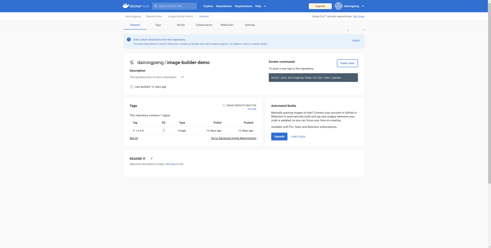

## 准备镜像
为了方便后续演示，简单使用go启动http服务。`examples/docker/images-builder-demo/main.go`

## 准备镜像描述文件
Docker v17.05 开始支持多阶段构建 (multistage builds), 缩减最终交付的镜像大小。

```Dockerfile
FROM golang:alpine as builder
ENV GO111MODULE=on GOPATH=/workspace/go

WORKDIR /workspace
COPY docker .

RUN go mod download -x
RUN CGO_ENABLED=0 go build -o main main.go

FROM alpine:latest as prod

WORKDIR /app
COPY --from=builder /workspace/main .

RUN chmod +x main
CMD ["./main"]
```

提交镜像是廉价的，镜像之间有层级关系，像一棵树。不要害怕镜像的层数过多，我们可以在任一层创建一个容器。因此不要将所有命令写在一个RUN指令中。RUN指令分层，符合Docker的核心概念，这很像源码控制。

Docker镜像的另外一个核心概念是可重复性和可移植性，镜像应该在任何主机上运行多次。所以EXPOSE命令，不要在Dockerfile中做端口映射，端口映射在`docker run`命令中指定即可，Dockerfile如果需要，仅使用EXPOSE命令暴漏端口即可

## 镜像构建
```shell
 ~/workspace/house/dairongpeng/examples/docker/image-builder-demo/ [master+*] ls
Dockerfile go.mod     main.go
 ~/workspace/house/dairongpeng/examples/docker/image-builder-demo/ [master+*] docker build -t image-builder-demo:v1.0.0 .
# ...more log...
 ~/workspace/house/dairongpeng/examples/docker/image-builder-demo/ [master+*] docker images          
REPOSITORY           TAG       IMAGE ID       CREATED          SIZE
image-builder-demo   v1.0.0    19b3ddbe9e81   15 minutes ago   17.9MB
 ~/workspace/house/dairongpeng/examples/docker/image-builder-demo/ [master+*] docker run --name image-builder -p 8081:8081 -d image-builder-demo:v1.0.0  ./main -port=8081
5524930e9938ec83c80823b08158b0531669f4bf2e9a32bd624fa5249573bee9
 ~/workspace/house/dairongpeng/examples/docker/image-builder-demo/ [master] docker ps
CONTAINER ID   IMAGE                       COMMAND               CREATED         STATUS         PORTS                    NAMES
5524930e9938   image-builder-demo:v1.0.0   "./main -port=8081"   3 seconds ago   Up 2 seconds   0.0.0.0:8081->8081/tcp   image-builder
 ~/workspace/house/dairongpeng/examples/docker/image-builder-demo/ [master] docker logs 5524930e9938
2023/02/17 03:18:01 server run at :8081
 ~/workspace/house/dairongpeng/examples/docker/image-builder-demo/ [master+*] curl 127.0.0.1:8081/helthz
OK
 ~/workspace/house/dairongpeng/examples/docker/image-builder-demo/ [master+*] docker exec -it 5524930e9938 sh
/app # ls
main
/app #
```

## 最终交付件
可以docker login登录自己的仓库，docker push交付镜像到仓库供其他人下载使用。
```shell
 ~/workspace/house/dairongpeng/examples/docker/image-builder-demo/ [master] docker login -u dairongpeng
Password:
Login Succeeded

Logging in with your password grants your terminal complete access to your account.
For better security, log in with a limited-privilege personal access token. Learn more at https://docs.docker.com/go/access-tokens/
 ~/workspace/house/dairongpeng/examples/docker/image-builder-demo/ [master*] docker tag image-builder-demo:v1.0.0 dairongpeng/image-builder-demo:v1.0.0
 ~/workspace/house/dairongpeng/examples/docker/image-builder-demo/ [master*] docker images
REPOSITORY                       TAG       IMAGE ID       CREATED          SIZE
image-builder-demo               v1.0.0    30e6351c8f83   18 minutes ago   17.9MB
dairongpeng/image-builder-demo   v1.0.0    30e6351c8f83   18 minutes ago   17.9MB
 ~/workspace/house/dairongpeng/examples/docker/image-builder-demo/ [master*] docker push dairongpeng/image-builder-demo:v1.0.0
The push refers to repository [docker.io/dairongpeng/image-builder-demo]
e68477738004: Pushed
206d08b04ec1: Pushed
1ffc2e3e8d86: Pushed
8d3ac3489996: Mounted from library/alpine
v1.0.0: digest: sha256:1acf252530ebd1bbdc8efdd0c930ff6d84cde9f0ce62ccdeb94f1381bd305fff size: 1157
```

## 使用交付件
