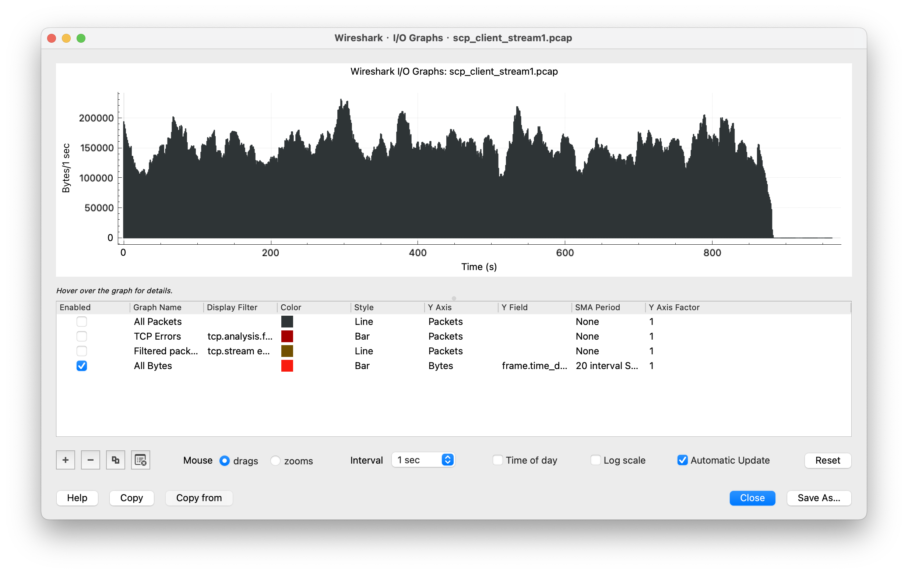
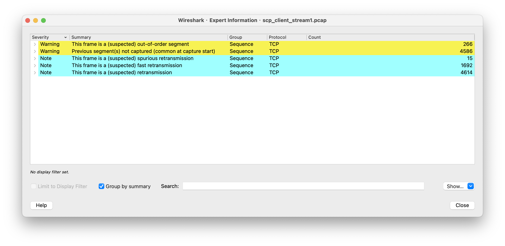
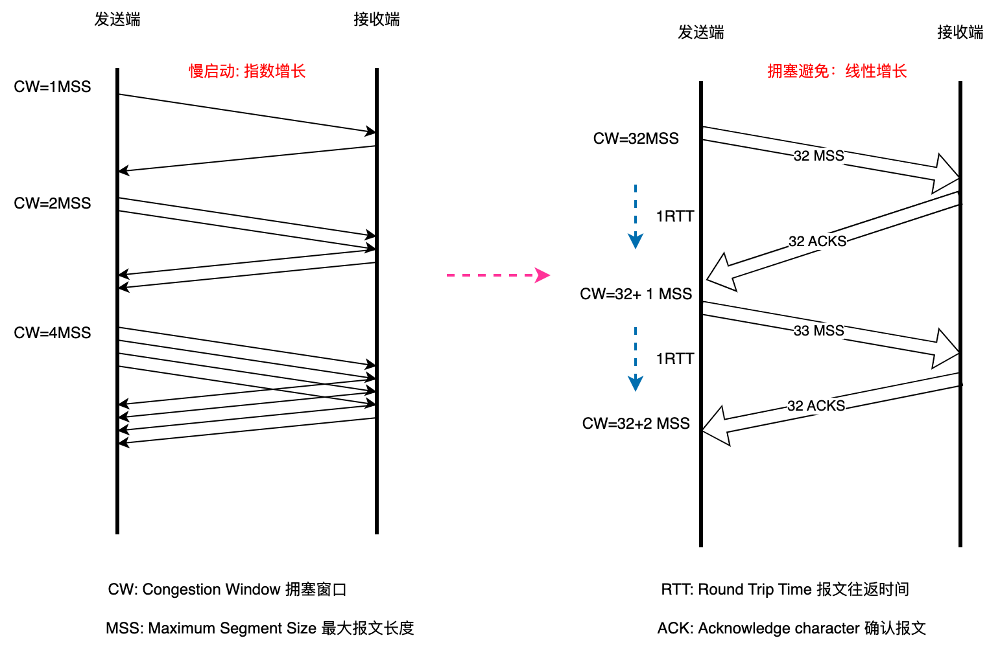

## 前置知识
现象：专线网络速度上不去，抓包文件见：`example/net/scp_client_stream1.pcap`

### 网速排查路径

#### 分析IO Graph
打开抓包分析软件，查看I/O Graph如下图, 查看整体数据包的传输速度大概在100到200k/s：

#### 分析Expert Infomation
- Warning 级别有两种，分别是乱序（Out-of-Order）和前面报文未抓取的情形。这两者本质上都是乱序引起的现象。
- Note 级别，一共有四种，分别是：
    - Spurious 重传：这是已经被确认过的数据再一次被重传。
    - 快速重传：收到 3 次及以上次数的重复确认后，不等超时就做出的重传。
    - 重传：超时计时器到点而触发的重传，这就是有名的超时重传。
    - 重复确认：确认号重复的多个报文，重复确认是引发快速重传的原因。
- Chat 级别的 TCP Window update，这里主要是客户端（上海）向 SSH 服务端（北京）通告自己的接收窗口的变化，是比较正常的行为。

### 窗口
TCP传输速度大体上是窗口除以往返时间(如果存在TCP Full Win), 就是被接收端确认的数据除以往返时间。而这里的窗口，在不同情境下就有着不同的含义。我们用 CW（Congestion Window）来指代自身的拥塞窗口，而用 RW（Receive Window）指代对端的接收窗，那么win小，这里的窗口就是取小的那个win。
- 情况1，if RW < CW, 取RW
- 情况2，if RW > CW, 取CW

结论：

- 对于情况1，如果接收端的接收窗口，小于传输中的拥塞窗口，那么抓包有可能会存在TCP Window Full。
- 对于情况2，如果传输中的拥塞窗口，大于接收端的接收窗口，那么抓取的包中，可能会存在Out of Order， retransmission的警告包。

拥塞窗口是每个连接分开维护的，比如同一个主机有两个 TCP 连接在传输数据的话，那么这两个连接就各自维护自己的拥塞窗口，比如一个很大而一个很小，都没有关系。每个TCP链接，接收端和发送端各自维护一个CW。

## TCP拥塞控制
### 慢启动

慢启动（Slow Start），是指 TCP 传输的开始阶段是从一个相对低的速度开始的。在这个阶段，拥塞窗口会以翻倍的方式增长。每次收到确认的ACK， 拥塞窗口就增加一个MSS（MSS一般为1460字节）。当遇到了拥塞，或者拥塞窗口增长到了**慢启动的阈值(ssthresh)**时，发送端翻倍增长MSS会停止（进入拥塞避免阶段）。

初始慢启动阈值ssthresh可以大胆一点设置为一个很大的值。当遇到拥塞的时候（超时或者3个DupAck），慢启动阈值会减为当前这个拥塞点的拥塞窗口的一半，这个时候的慢启动阈值，就是适配了实际情况的值，而不是最初那个大胆设置出来的值。所以，首次慢启动后一般不会主动进入拥塞避免，而是等出现拥塞才获取到第一个实际可用的慢启动阈值。

### 拥塞避免
当拥塞窗口增到到超过ssthresh这个阈值的时候，拥塞窗口的增长速度立刻就放缓了，变成了每过一个 RTT，拥塞窗口就只增长一个 MSS（此前是每个确认数据的 ACK，增长一个 MSS）。假设一开始拥塞窗口，ICW是4个MSS，ssthresh是32个MSS。在慢启动阶段，经过一个RTT后，CW扩大为8个MSS，然后是16个 MSS，32个MSS，以指数级上升。

到了这个阈值后，TCP 就进入了拥塞避免阶段，每过一个 RTT，拥塞窗口只增加一个 MSS，于是在图上看，就又变成了一条平直的斜率比较低的直线了。

当到达慢启动阈值ssthresh后，线性增长，每个RTT增加一个MSS, 直到探测到拥塞，然后窗口折半下降，被称作乘星降低。

其实丢包对于发送端来说就是“拥塞”，然后它就根据拥塞控制机制，主动进入拥塞避免阶段，以确保传输速度，不至于大面积丢包。事实上就自动降低了速率，达到了我们想要的“限速”的效果。拥塞控制机制对 TCP 传输十分重要，技术细节也很复杂，所以是由内核实现的。这也是内核实现 TCP 栈的巨大优势：应用程序可以集中于业务逻辑，而不需要操心传输和拥塞这种底层细节了。

### 快速重传
TCP 每发送一个报文，就启动一个超时计时器。如果在限定时间内没收到这个报文的确认，那么发送方就会认为，这个报文已经在网络上丢失了，于是需要重传这个报文，这种形式叫做超时重传。

一般来说，TCP 的最小超时重传时间为 200ms。但默认的200ms对于时间要求较高的应用来说，影响比较严重。TCP还有一种快速重传机制。在这个机制里，一旦发送方收到 3 次重复确认（加上第一次确认就一共是 4 次），就不用等超时计时器了，直接重传这个报文。

TCP 快速重传机制是指从收到第三个重复确认消息开始，不等待超时重传计时器的到期，而是立即重传丢失的数据包。这样可以减少网络拥塞时的重传等待时间，提高网络数据传输效率。

### 快速恢复
TCP 快速恢复机制是在快速重传的基础上，允许发送方继续发送数据，而不需要等待慢启动过程。这个机制允许发送方的速度尽快回到拥塞前的状态，而不会因为等待慢启动而产生的延迟。

当 TCP 发送网络数据包时，如果遇到网络拥塞导致数据包被丢失，TCP 快速重传和快速恢复机制可以避免让网络空闲时间拉长，加快网络的恢复速度。这个机制可以有效地提高 TCP 传输的效率和可靠性。

## 重传
TCP 最核心的价值，如果说只有一个的话，那就是对可靠传输的保证。而要实现可靠的传输，可能需要这样做：如果我的报文丢了，应该在一定次数内持续尝试，直到传输完成；而如果这些重传都失败了，那就及时放弃传输，避免陷入死循环。

### 超时重传（Timeout Retransmission RTO）
触发超时重传的时机：
- 报文在发送途中丢失，没有到达接收方，那接收方也不会回复确认包。
- 报文到达接收方，接收方也回复了确认，但确认包在途中丢失。

当报文发出后，发送方开启一个定时器，也就是Timeout, 在该段时间内没收到接收方的确认报文ACK的话，触发重传操作。如果在该段时间内收到的接收方的ACK，计时器清零。

当然，超时重传也还是可能会丢包，此时发送方一般会以 RTO 为基数的 2 倍、4 倍、8 倍等时间倍数去尝试多次。(指数退避)

重传超时时间，在RFC6298中规定是1s，更早的规范是3s。在一条 TCP 连接刚刚开始，还没有收到任何回复的时候，这时的超时 RTO 为 1 秒，一个报文发送后1s没有收到ack，就会触发报文重传。而当在TCP连接成功建立后，Linux 会根据 RTT 的实际情况，动态计算出 RTO。实际场景中，RTO 为 200ms 出头最为常见。一般情况下，ROT室友上下界的，Linux 的这两个值分别是 120 秒和 200 毫秒。

超时重传：
- TCP 对于每条连接都维护了一个超时计时器，当数据发送出去后一定时限内还没有收到确认，就认为是发生了超时，然后重传这部分数据。
- RTO 的初始值是 1 秒（在发送 SYN 但未收到 SYN+ACK 阶段）。
- 在连接建立后，TCP 会动态计算出 RTO。
- RTO 有上限值和下限值，常见值分别为 2 分钟和 200ms。
- 实际场景中，RTO 为 200ms 出头最为常见。

### 快速重传（TCP Fast Retransmission）
虽然超时重传可以避免发送方无限等待下去的情况（1s没收到确认就重传），但是等待的时间还是不短（1s），仅仅只是等待就白白浪费了传输时间。快速重传就是为了解决这个问题。

快速重传的触发场景是，如果对端回复连续 3 个 DupAck 即重复确认(意味着该报文接收端没收到，丢了)，我就把序列号等于这个 ACK 号的包重传， 而不再等待RTO(1s)。

不开启SACK，那么如果2号报文丢包，3号报文，4号报文正常到达接受端，那么接收端会回复3个2号报文的ACK。而当我们开启了SACK，那么这种情况接收端回复的2号报文的SACK，除了携带2号报文没收到的信息，还会告诉发送端，3号和4号已经收到。

SACK 要能工作，还需要 SACK permitted 这个 TCP 扩展属性的支持。那么如何检查是否开启了SACK呢，这个字段只有在 TCP 握手的 SYN 和 SYN+ACK 报文中出现，表示自己是否支持 SACK 特性。受限于 TCP Option 长度，SACK 部分最多只能容纳 4 个块。意味着即使2号报文丢失回传了SACK, 那么也只能有限的告诉发送方，额外收到了后续多少个报文的确认（不是无线的）。

快速重传：
- 快速重传的触发条件是：收到 3 个或者 3 个以上的重复确认报文（DupAck）。
- 在快速重传中，SACK（SACK 全称是 Selective Acknowlegement，中文叫“选择性确认”）也起到了避免一部分已经到达的数据被重传。不过，也由于 TCP 头部长度的限制，SACK 只能放置 4 个块，再多也不行了。
- 快速重传只要 3 个 DupAck 就可以触发，实际上我们还可能观察到远多于 3 个 DupAck 的情况，这也是正常现象。
- Spurious 重传对 TCP 传输的影响比快速重传和超时重传小很多，总体来说是一种影响不大的重传。

TCP 的确认报文如果丢失了，发送端还会不会重传?
- 1. 如果是三次握手时，第二个握手报文SYN+ACK 丢失，在经过一个 RTO 时间后，由于还没收到第三个握手报文，发生超时重传，会重传这个报文。
- 2. 如果发送端先后发送了报文n，n+1，接收端也先后确认了这两个报文，如果ACK[n] 传输时丢失，ACK[n+1] 正常传输，由于后者的确认范围涵盖了前者，那么即使 ACK[n] 丢失也不会有什么影响，则不会重传 ACK[n]。
- 3. 如果在情况2中，第 n+1 个报文是当前数据流的最后一个报文，且 ACK[n+1] 传输时丢失了，发送端经过1个RTO时间后会触发超时重传，接收端在接收到报文后会重传 ACK[n+1]。