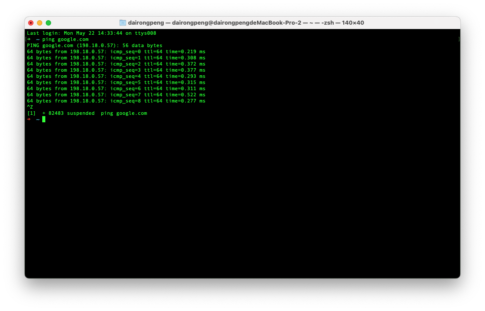
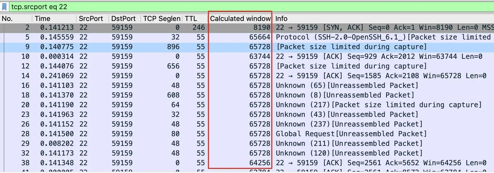
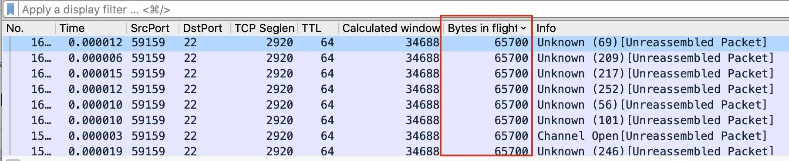
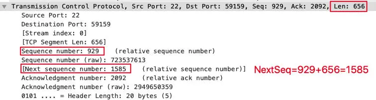
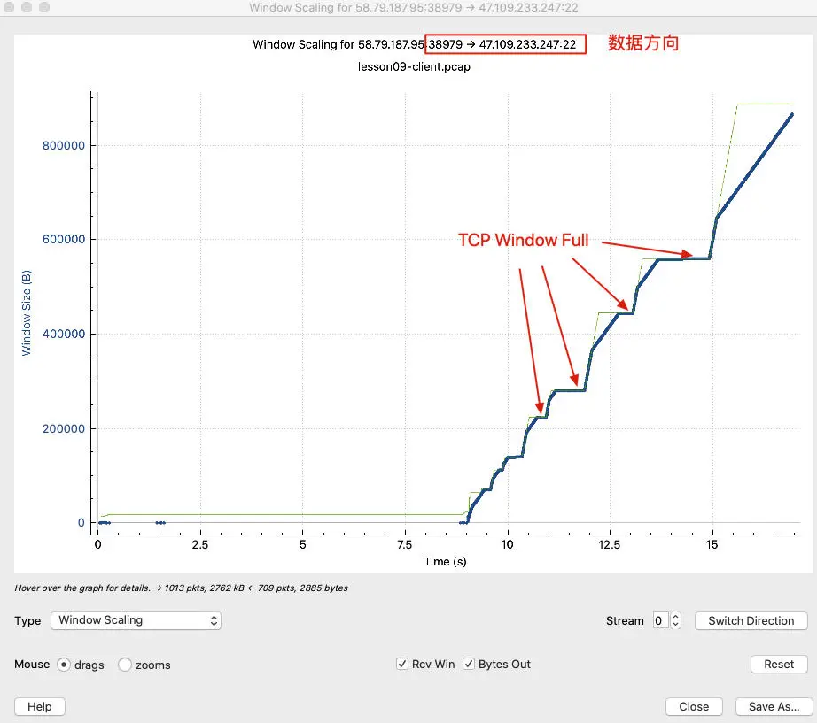

## TCP窗口
事实上，TCP 有 3 个窗口：接收窗口、拥塞窗口，还有发送窗口。

- **接收窗口**：它代表的是接收端当前最多能接收的字节数。通过 TCP 报文头部的 Window 字段，通信双方能互相了解到对方的接收窗口。
- **拥塞窗口**：发送端根据实际传输的拥塞情况计算出来的可发送字节数，但不公开在报文中。各自暗地里各维护各的，互相不知道，也不需要知道。
- **发送窗口**：对方的接收窗口和自身的拥塞窗口两者中，值较小者。实际发送的在途字节数不会大于这个值。

### 时延
在我们ping一台主机的时候，可以获取到时延信息。例如我们ping google.com每个包的响应时间是0.2ms。用 Ping 的原因是，它的 ICMP 报文比较轻量，不会引起双方很多的额外处理时间，所以适合用来获取相对纯粹的网络往返时间。



在 TCP 通信中，因为协议栈本身也需要做拆解包、缓冲、Socket 处理等工作，所以 TCP 层面的 RTT 会比 IP 层面的 RTT 略长一点。Wireshark 也提供了 RTT 信息。我们选取一个报文，在 TCP 详情的 SEQ/ACK analysis 部分，就有 iRTT 信息。

iRTT 是 intial RTT 的缩写，Wireshark 就是从 TCP 握手阶段的报文里计算出这个值的。对于客户端来说，就是发出 SYN 和收到 SYN+ACK 的间隔。对于服务端，就是发出 SYN+ACK 和收到 ACK 的间隔。

### 带宽时延积
例如我们的时延是 134ms，带宽是 10Gbps，那么带宽时延积就是 0.134×10Gb。转换为 Byte 需要再除以 8，得到约 168MB。这个数值的意思是，假设这条链路完全被这次的文件传输连接所占满，那么最多可以有 168MB 的在途数据。

当我们网速变慢的时候，我们可以算一下我们的带宽时延积，来判断带宽时延积是不是限制速度的瓶颈因素。

### 发送窗口
在 Wireshark 里查看接收窗口的数值也是很直观的, 任意一个 TCP 报文的头部都有 Window 字段，长度为 2 个字节，所以最大值为 2 的 16 次方，即 64KB。在第 3 讲我们讨论 TCP 握手相关案例时，提到过 Window Scale。它是在RFC1323中引进的，使得 Window 值最大能达到 2 的 30 次方，即 1GB。

- 添加 **Calculated window size** 为自定义列。操作方法是任选一个 TCP 报文，在 TCP 详情那里找到[Calculated window size:xxxx]，右单击，在弹出菜单中点击 Apply as Column。然后主窗口里就多了这样一列 Calculated window size。
- 在过滤器输入框输入 tcp.srcport eq 22，这样就把监听在 22 端口发出的报文过滤出来了，更加方便我们查看。



能从图中看出，传输起始阶段有不少重传。不过没关系，让我们集中注意力到接收窗口值上。这个阶段的接收窗口是后面稳定在64KB上下浮动，值偏小。照理来说，传输稳定阶段，接收窗口会大很多，也就应该会比64KB大不少。发送端实际的发送窗口是拥塞窗口和对方接收窗口这两者中的较小者。那究竟是多少呢？

- 选中传输中的一个报文，在 TCP 详情的[SEQ/ACK analysis]部分，找到[Bytes in flight]。
- 然后右单击，选中 Apply as column。可以直观的看到发送窗口。接近64KB



在一个还不错的长肥网络中，存在着一个"瘦管道"，瓶颈大概64kb，传输速度的上限就是 window/RTT = 64KB/134ms = 478KB/s！比如服务端使用了一些较老的网络设备，接受窗口比较小，那么即使宽带和时延都比较理想，最终网络传输速度也会是短板效应，因为发送窗口的大小取对方的接收窗口和自身的拥塞窗口两者中，值较小者。实际发送的在途字节数不会大于这个值。

基于以上，我们得以推导出最终的核心公式：网络速度上限 = 发送窗口 / 往返时间。用英文可以表示为：velocity = window/RTT。（网络存在滞留时该公式不适用，参考下文）

处理 TCP 传输速度问题的时候，一样可以应用上面这些知识：先获取时延，再定位发送窗口，最后用这个公式去得到速度的上限值。

REF: [TCP性能和发送接收Buffer的关系](https://plantegg.github.io/2019/09/28/%E5%B0%B1%E6%98%AF%E8%A6%81%E4%BD%A0%E6%87%82TCP--%E6%80%A7%E8%83%BD%E5%92%8C%E5%8F%91%E9%80%81%E6%8E%A5%E6%94%B6Buffer%E7%9A%84%E5%85%B3%E7%B3%BB/)

### 关于NextSeq
下个序列号，也就是 Next Sequence Number，缩写是 NextSeq。它是指当前 TCP 段的结尾字节的位置，但不包含这个结尾字节本身。很显然，下个序列号的值就是当前序列号加上当前 TCP 段的长度，也就是 NextSeq = Seq + Len。



```shell
# 在途数据 = 客户端发送的数据的最新的位置 - 服务端确认客户端的报文位置
# 比如服务端确认客户端的报文是198854, 客户端发给服务端的最新的报文的NextSeq为310854
# 那么此时客户端和服务端之间的在途数据就是310854 - 198854 = 112000
Bytes_in_flight = latest_nextSeq - latest_ack_from_receiver
```
- Acknowledgement Number：确认号; 
- Next Sequence Number：下个序列号; 
- Caculated Window Size：计算后的接收窗口; 
- Bytes in flight：在途字节数;

打开 Wireshark 的 Statistics 下拉菜单，找到 TCP Stream Graphs，在二级菜单中，选择 Window Scaling。查看窗口的变化趋势.
- 数据流的方向在面板的上方
- Receive Window 是“阶梯”式的，每次变化后会保持在一个“平台”一小段时间，那么这时候 Bytes Out（发送的数据，也就是 Bytes in flight）就有可能触及这个“平台”，每次真的碰上的时候，就是一次 TCP Window Full。
- 选中了一个 Receive Window 和 Bytes Out 重合的点，定位到了这个报文，它是一次 TCP Window Full。
- 蓝线是Bytes Out， 绿线是Receive Win



### 窗口现象
当数据没有滞留的时候，每个数据包都被及时ACK了，网络速度近乎等于在途字节数除以RTT:

```shell
v = windown(Bytes in flight) / RTT
```

当数据存在滞留，也就是窗口受限，产生`TCP Window Full`时（未被确认的数据量（也就是在途字节数）跟B的接收窗口相等产生），真实网速，等于被确认的数据包，除以RTT。TCP Window Full 确实会影响到传输速度。当接受端确认了数据包，比如300Bytes，发送端收到确认后立马又填充300bytes到发送缓冲区，进而到窗口中，所以窗口未变，但是网速变慢了。:

```shell
velocity = acked_data / RTT
```